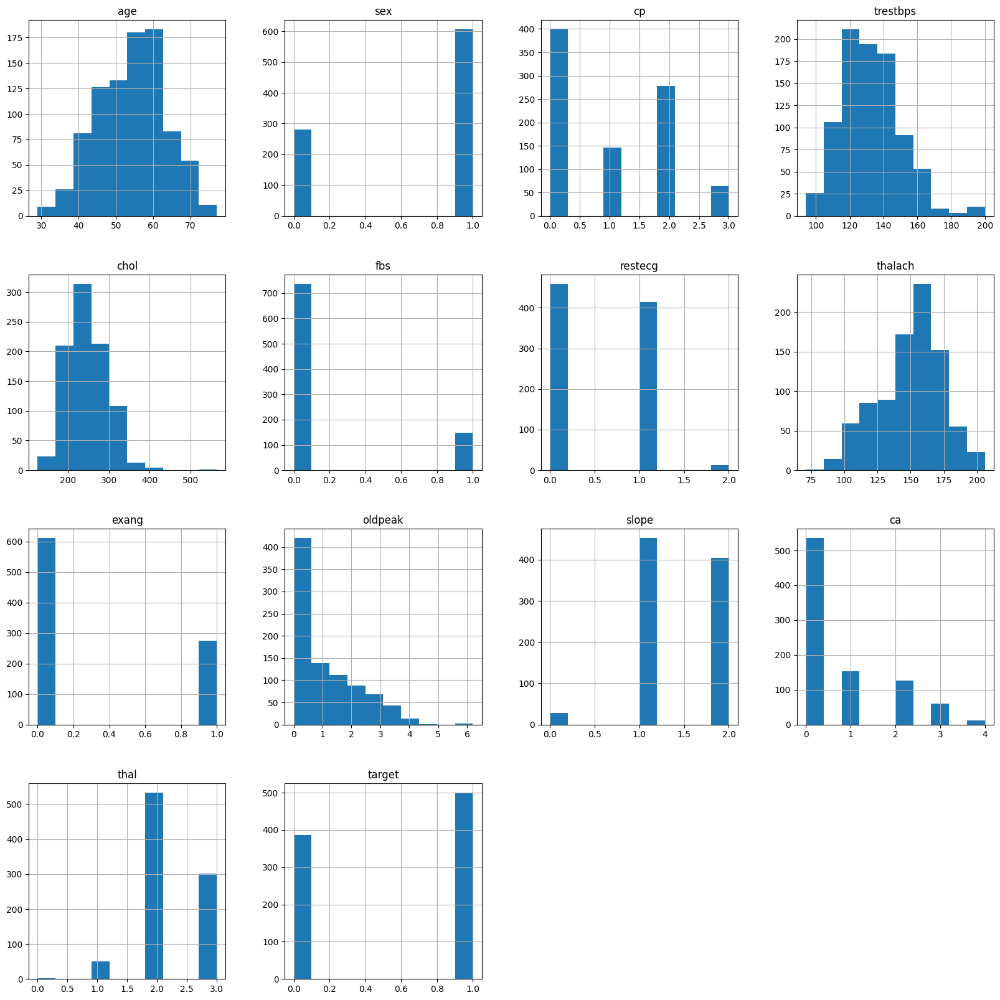
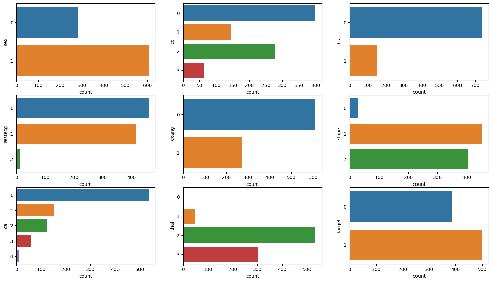
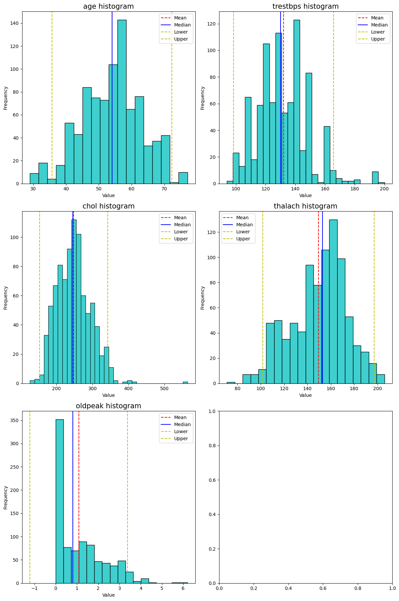
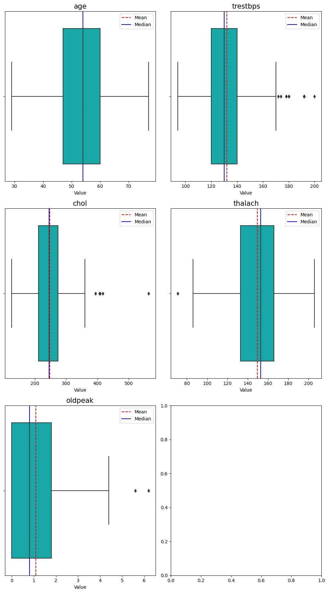
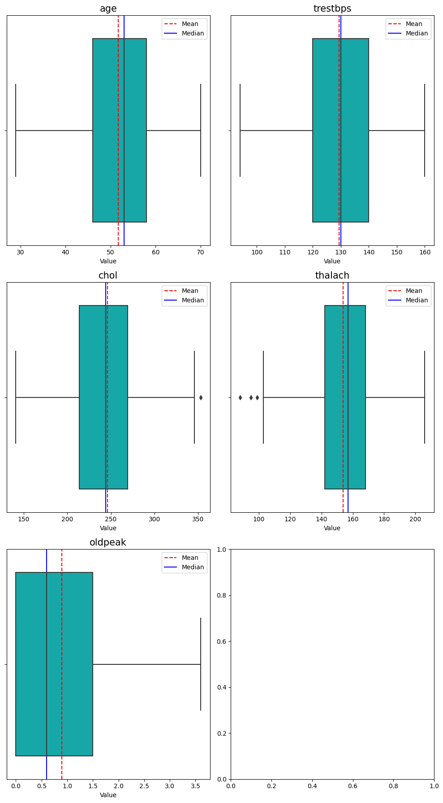
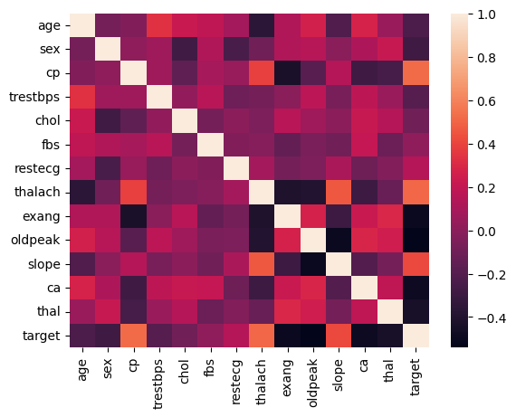
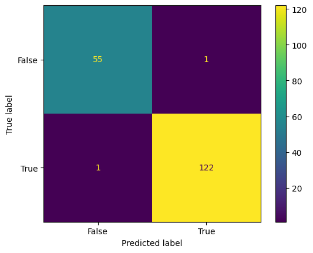

# Logistic Regression
1. About dataset:

2. Categorical features:

3. Numerical features:

4. Boxplot used to observe outliers:

5. Cleaned outliers: 

6. Correlation between the features: 

7. Logistic Model on test set with training set and testing set ratio is 70:30  

8. Model on data set: 
